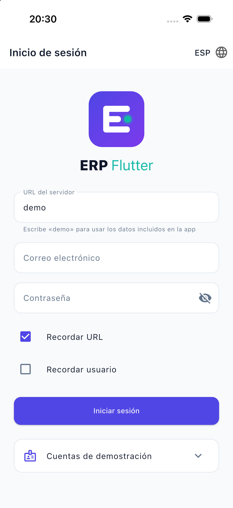
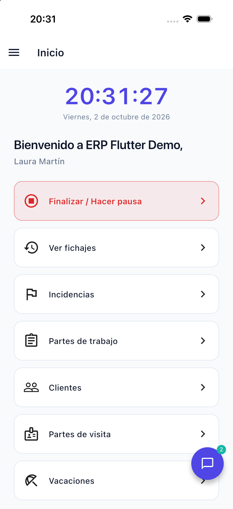
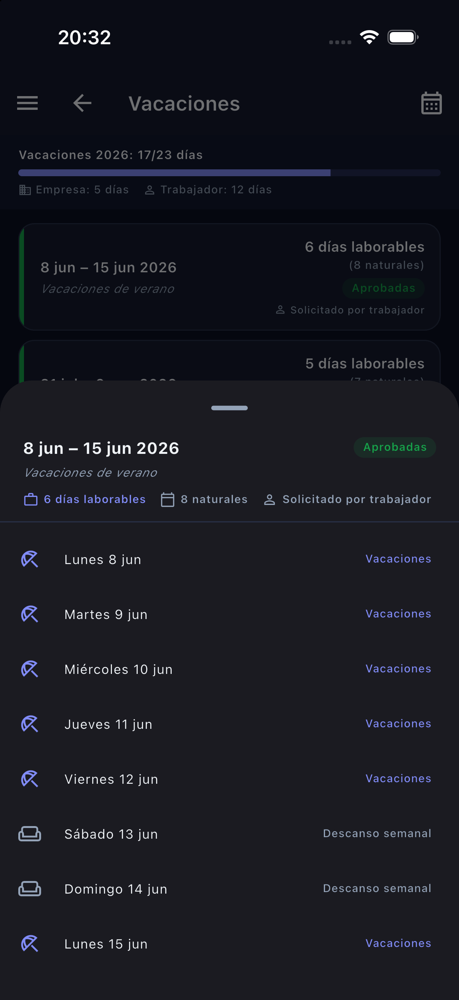

# ERP Flutter · Web demo of an ERP app in production

> [!IMPORTANT]
> **This is the public demo of a real application.**
> I built the original app, together with most of its Laravel/PHP API, during my internship at **Microvalencia Soluciones Informáticas**. It is in production with the company's ERP, and the company is preparing its release on Google Play Store and App Store. Its source code belongs to the company and is not public.
>
> This repository is a **from-scratch rewrite** with the same features and screens, but with a different identity, **made-up data** and a static backend. It contains no Microvalencia code or data.

**Live demo:** [raulesteveza.github.io/demos/ERP_Flutter](https://raulesteveza.github.io/demos/ERP_Flutter/)\
**Video of the real app:** [youtu.be/lrgRXaBEdI4](https://youtu.be/lrgRXaBEdI4)

  
  &nbsp;
  
  &nbsp;
  

- 🇬🇧 **English:** [Full project documentation](./README_en.md)
- 🇪🇸 **Español:** [Documentación completa del proyecto](./README_es.md)

## The real app

A Flutter app that brings the company's ERP to the phone for staff on the move. It covers clock-in/out with GPS, incidents, holidays with an approval flow, clients and their documents, visit reports, work reports with lines, photos, audio and client signature, internal messaging and role-based access for six user profiles. It is available in Spanish, Valencian, Catalan and English.

Its scope was set by the company: rather than giving the phone full autonomy over the ERP, the app is day-to-day support for staff who already use it, so some actions deliberately stay in the desktop ERP.

**Built with:** Flutter, Dart, MVVM, SOLID, Dio, FlutterSecureStorage, Geolocator and Flutter Flavors for the app, plus PHP, Laravel and REST APIs for the backend.

## This demo

- **Same app, rewritten:** same modules, navigation and roles, under the name *ERP Flutter* with its own colours and logo.
- **No backend needed:** a static JSON backend generated by a script. Dates are relative to today, so the data always looks recent.
- **Changes stay with each visitor:** clock-ins, signatures, photos and messages are stored on the device or in the browser, and can be reset from the side menu.
- **Ready to try:** demo accounts for every role on the login screen (password `demo1234`).
- **Deployed automatically:** every push to `main` is tested, built and published to my website with GitHub Actions.

## Developer

**Raul Estevez**

- [Personal Website](https://raulesteveza.github.io/)
- [LinkedIn Profile](https://www.linkedin.com/in/raulesteveza/)
